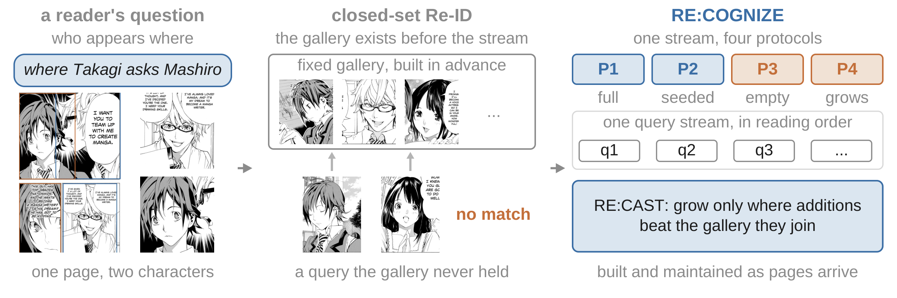
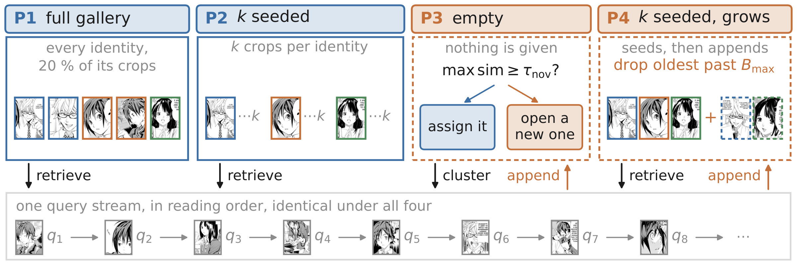
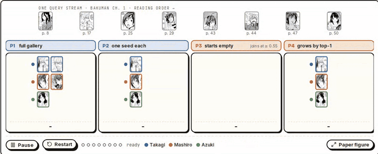
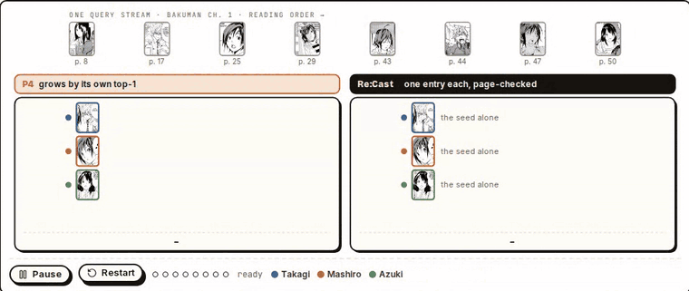
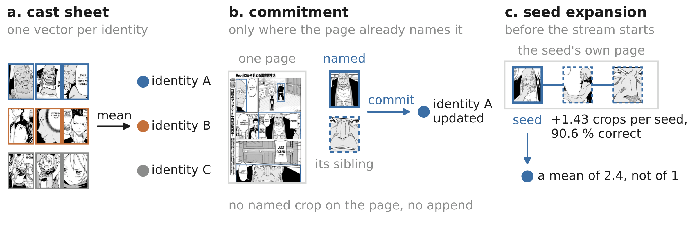
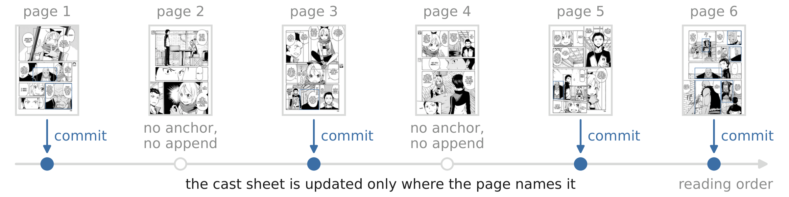

<h1 align="center">Re:Cognize: Open-Set Comic Character Re-Identification</h1>

<p align="center">
  <a href="https://sochastic.me">Aaditya Baranwal</a> · Madhav Kataria<sup>*</sup> · Yogesh S. Rawat · Shruti Vyas<br>
  Institute of Artificial Intelligence, University of Central Florida<br>
  <sub><sup>*</sup>Work done as an intern at the University of Central Florida.</sub>
</p>

<p align="center">
  <a href="https://re-cognize.vercel.app"></a>
  <a href="https://neurips.cc/Conferences/2026"></a>
  
  <a href="https://github.com/eternal-f1ame/Re-Cognize/releases/tag/neurips-2026"></a>
</p>

<p align="center">
  
</p>

Re:Cognize evaluates comic character re-identification the way a reader meets characters: one
stream of character crops in reading order, answered against four galleries.

<p align="center">
  
</p>

<p align="center">
  
  <br><sub>MagiV2's own decisions on eight crops of Bakuman chapter 1, replayed under each protocol. One Mashiro crop is
  closer to Azuki's seed: P1 still gets it right, P2 does not, and P4 files it under Azuki, where two later Mashiro crops
  match it.</sub>
</p>

| Protocol | Gallery |
|---|---|
| P1 | every character, built in advance (closed-set retrieval) |
| P2 | a few labelled seeds per character |
| P3 | empty: the model organises the stream into characters itself (a diagnostic of emergence) |
| P4 | the seeds, grown by the model as it reads |

The paper finds that assembling a gallery is close to solved, while growing one is not. A
gallery that adds the model's own matches gets worse, while the same growth with correct labels
would add over twenty points of top-1 accuracy. One comparison decides whether a change to the
gallery pays. **Re:Cast** acts on it with nothing fitted on data: one running average per
character, grown only where the page vouches for a crop. A memory-augmented encoder serves as
the maintenance baseline.

<p align="center">
  
  <br><sub>The same stream against two ways of growing the gallery. Growth by top-1 ends at five of eight with three wrong
  additions; Re:Cast adds only the two crops their page ties to a seed and ends at seven of eight.</sub>
</p>

<p align="center">
  
  
</p>

This repository holds the evaluation harness, the Re:Cast gallery, the memory-block baseline and
its trainer, the analysis scripts behind every number in the paper, and the generators of its
tables and figures.

## Layout

```
src/recognize/       evaluation harness: data and reading order, backbones, metrics, protocols P1-P4
src/memory_block/    the memory-block baseline and its trainer
scripts/             train.py and evaluate.py launchers, weights and results fetchers, reports, SLURM examples
configs/             series splits and the training campaign
analysis/            the analyses behind the paper's numbers (Re:Cast, binding, diagnostics)
paper/               generators of the paper's tables and figures
docs/                protocols.md (the specification) and reproducing.md (every command)
tests/               unit and regression tests
project/             the project page (Next.js)
```

## Setup

```bash
conda env create -f environment.yml && conda activate recognize
export PYTHONPATH=$PWD/src:$PWD/scripts:$PYTHONPATH PYTHONHASHSEED=0
bash reid_models/setup.sh          # third-party backbones at pinned commits, and their weights
```

`reid_models/README.md` covers the backbones, including the one checkpoint that is downloaded by
hand, and `Datasets/README.md` covers the three corpora: POPCharacters, Manga109 and Re:Verse.
The evaluation refuses to run unless `PYTHONHASHSEED` is pinned, because the hash seed would
otherwise change the reading order of a stream.

## Regenerate the paper's tables from the released results

No GPU and no dataset are needed:

```bash
python scripts/fetch_results.py            # downloads and verifies results/ (23 MB)
python paper/paper_tables.py --table cross --out paper/generated/tables/popcharacters_eval_scores.tex
python paper/paper_tables_recast.py --table recast --out paper/generated/tables/recast_combined.tex
```

`docs/reproducing.md` lists the generator of every table and figure.

## Train and evaluate

```bash
python scripts/train.py list
python scripts/train.py run magiv2_memory_seed0
python scripts/evaluate.py --checkpoint checkpoints/magiv2/memory/seed0/final.pth \
    --out results/popcharacters/magiv2_memory_seed0
python scripts/evaluate.py --pretrained magiv2 --out results/popcharacters/pretrained__magiv2
```

`docs/reproducing.md` gives the full campaign: the 84 training runs, the four groups of
evaluation runs and the command behind every analysis output.

## Tests

```bash
python -m pytest tests -m "not slow"      # CPU, a few minutes
python -m pytest tests                    # also builds the real backbones
```

## Citation

```bibtex
@inproceedings{baranwal2026recognize,
  title     = {Re:Cognize: Open-Set Comic Character Re-Identification},
  author    = {Baranwal, Aaditya and Kataria, Madhav and Rawat, Yogesh S. and Vyas, Shruti},
  booktitle = {Advances in Neural Information Processing Systems (NeurIPS), Evaluations and Datasets Track},
  year      = {2026}
}
```

## License

The code is released under the MIT License (`LICENSE`). The datasets, the third-party backbone
code and their weights keep their own licences; see `Datasets/README.md` and
`reid_models/README.md`.
